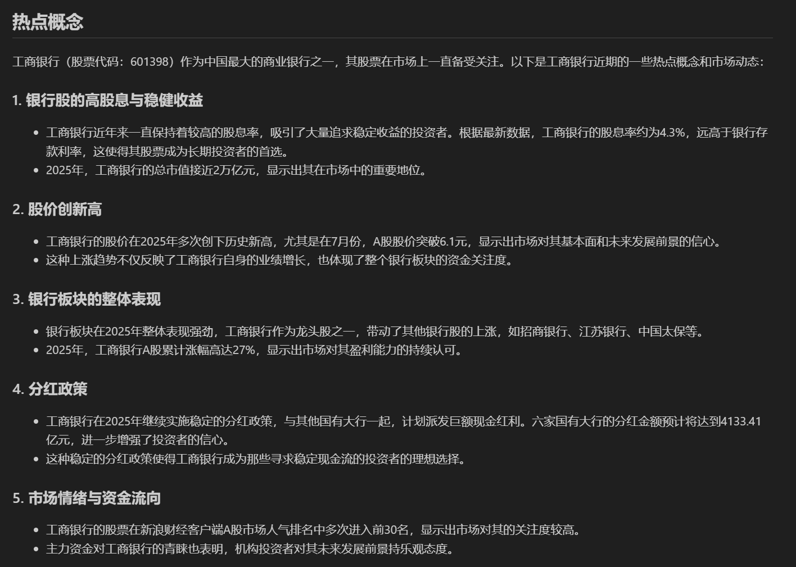

## FinRAgent
该项目利用 Autogen 自动化框架，使用modelscope上提供的微软Playwright和发现报告MCP服务，针对个股进行研报观点总结和热点概念总结。它能够自动获取最新的个股研报，提取关键观点，并分析与该股票相关的热门概念和市场动态。

### 功能特点


个股研报总结：自动获取某只股票的最新研报并生成其关键观点总结。

热点概念识别：分析某只股票相关的市场热点概念和趋势，实时跟踪热点话题。

提供接口：通过FastAPI提供调用接口


### 环境要求

Python 3.10+

autogen 库

python-dotenv 用于加载环境变量

微软Playwright MCP 用于内容搜索


### 安装与配置

1.克隆仓库：

git clone https://github.com/yourusername/stock-insights-summary.git
cd stock-insights-summary


2.安装依赖：


1）pip install -r requirements.txt

2）npx @playwright/mcp@latest --port 8931 （详情参考modelscope上的MCP服务）

3.配置环境变量：

在项目根目录创建 .env 文件，填写必要的 API 密钥或配置参数：

API_KEY=your_api_key_here
DATABASE_URL=your_database_url_here
PLAYWRIGHT_SERVER_URL=your_playwright_server_url_here


 

### 使用方法

运行个股研报总结与热点概念分析：

在环境配置完成后，你可以运行 main.py 脚本，启动fastapi服务，然后发起请求：

输入参数 1.tname:标的名称  2.save_path：结果保存路径

```pyython
import requests
url ='http://127.0.0.1:7000/get_info'
requests.post(url=url,json={"tname":"工商银行","save_path":'./results'}).json()
```
生成的md文件将会保存在"save_path"的路径中


示例输出：

